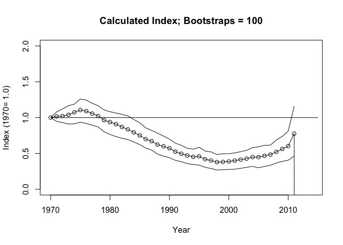
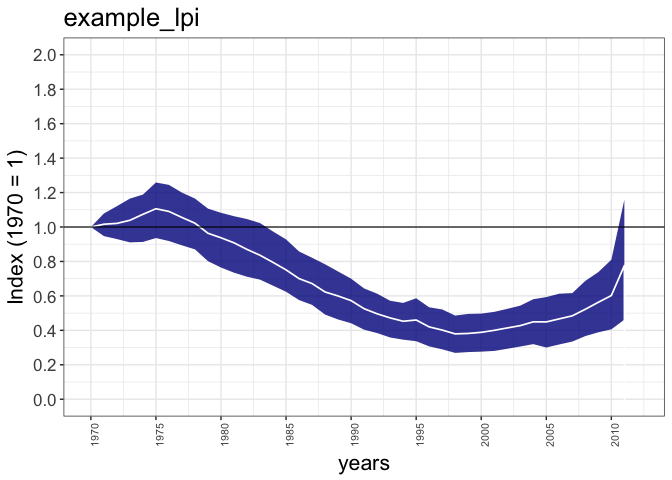
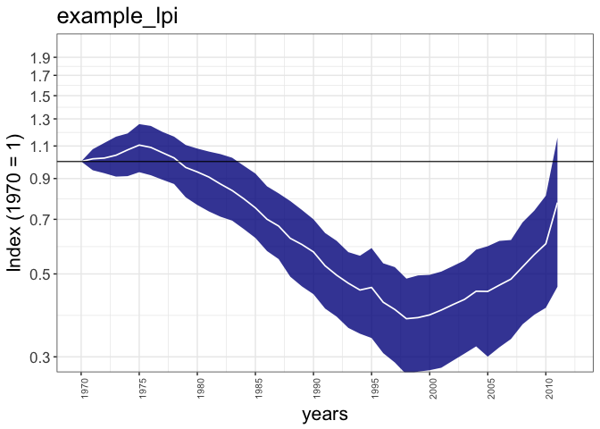
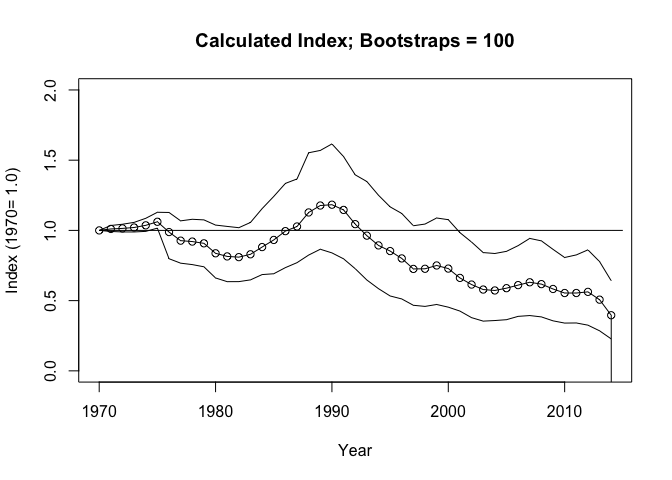
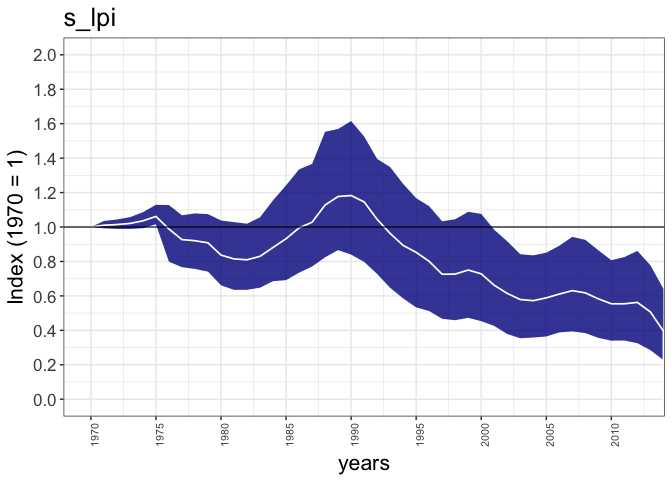
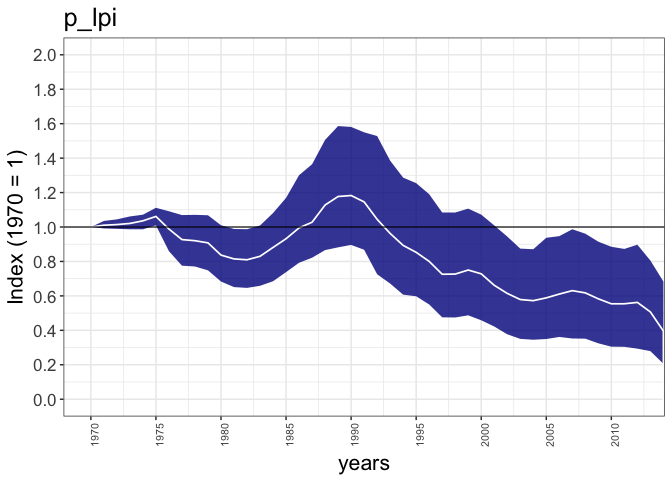

# rlpi package
Robin Freeman, IoZ, Zoological Society of London  
`r format(Sys.Date())`  


##Using the rlpi package 

### Overview

The **rlpi** package calculates indices using the Living Planet Index methodology, as presented in McRae et al. (in review) *The diversity weighted Living Planet Index: controlling for taxonomic bias in a global biodiversity index*.

In summary, indices are calculated using the geometric mean, first combining population trends to the species level, and then across higher taxonomic and geographical groupings. For example, multiple populations within a biogeographic realm will be combined first to generate individual species indices, then combined to taxonomic groups such as *birds*, *mammals*, *reptiles*, *amphibians*, before being combined to an index for the biogeograhic realm

The **rlpi** package works with source data in comma seperated format where each row is composed 
of **popid**, **speciesname**, **year**, **popvalue** (see below). These can be stored be in multiple groups (e.g. a file for Afrotropic bird populations, one for Afrotropical mammal populations, etc), and an 'infile' tells the package where these groups/files are and how to combine them. 

When constructing an index for just a single group, you would need a single data file and a single
infile which points to that data file (see first example below). For multiple groups, the infile would refer to all relevant datafiles and can specify weightings (to allow for weighting by taxonomic, geographical , etc).

The example given below includes an example dataset for terrestrial vertebrates
with a complex infile with multiple weighted groups and a simple infile for Nearctic mammals

NB: At present the code combines population time-series to the species level, generating
an average index for each species, then combines these into higher groups. If you don't wish
to combine to the species level (to generate an index where populations are weighted equally rather then species), then the 'speciesname' column will need to be unique for each population (which can be achieved, for example, by concatenating the speciesname and popid columns)

### Installing the package and examples

First, install the devtools package to enable installing from github:


```r
install.packages("devtools")
```

Then install the **rlpi** package from our github:


```r
library(devtools)
```

```
## Warning: package 'devtools' was built under R version 3.2.5
```

```r
# Install from main ZSL repository online
install_github("Zoological-Society-of-London/rlpi", auth_token = "3e95e9d1c26c0bd8f9fed628b224dbe811064c20")
```

```
## Downloading GitHub repo Zoological-Society-of-London/rlpi@master
## from URL https://api.github.com/repos/Zoological-Society-of-London/rlpi/zipball/master
```

```
## Installing rlpi
```

```
## '/Library/Frameworks/R.framework/Resources/bin/R' --no-site-file  \
##   --no-environ --no-save --no-restore --quiet CMD INSTALL  \
##   '/private/var/folders/w6/_grgw1n52vqgn5l480q1s_m5hs9z1z/T/RtmpKl29d3/devtools1414551501d0/Zoological-Society-of-London-rlpi-2f0ea62c8617def0a43a0f33f250f681915d1851'  \
##   --library='/Library/Frameworks/R.framework/Versions/3.2/Resources/library'  \
##   --install-tests
```

```
## 
```

Then the library can be loaded as normal


```r
# Load library
library(rlpi)
```

And some example data can be extracted from the package:


```r
# Get example data from package
# Copy zipped data to local directory 
file.copy(from=system.file("extdata", "example_data.zip", package = "rlpi"), to=getwd())
# Extract data, this will create a directory of terrestrial LPI data to construct a terrestrial index from.
unzip("example_data.zip")
```

## Example data

Within the example data are a number of 'infiles', these files (take a look at them!) contain links to other files arranged into groups and including weightings. 

For example **terrestrial_class_nearctic_infile.txt** which constructs and index for a single group contains:

```
"FileName"	"Group"	"Weighting"
"class_realms/terrestrial_lpi_rc_p1970_Nearctic_Mammalia.txt"	1	0.175804093567251
```

This references a single 'population' data file (the raw data) in the **class_realms** folder  which in this case contains population counts for Neartic mammals (again, have a a look), in this format:

first six lines of **class_realms/terrestrial_lpi_rc_p1970_Nearctic_Mammalia.txt**:

```
Binomial	ID	year	popvalue
Ovis_canadensis	4618	1950	390
Ovis_canadensis	5328	1950	1500
Myodes_gapperi	4560	1952	17
Sorex_cinereus	4587	1952	3
Napaeozapus_insignis	4588	1952	18
...
```

## Creating an index using example data

Using these files to contruct a Neartic index can be done as follows:


```r
# Make a Neactic LPI 
# Default gives 100 boostraps (this takes a couple of minutes to run on a 2014 Macbook)
Nearc_lpi <- LPIMain("terrestrial_class_nearctic_infile.txt", use_weightings = 1)

# That should have produced a simple plot, but we can use ggplot_lpi to produce a nicer one
ggplot_lpi(Nearc_lpi, ylims=c(0, 2))

# Make a Neactic Mammals LPI 
# Default gives 100 boostraps (this will take a few minutes to run (on a 2014 Macbook))
Nearc_mams_lpi <- LPIMain("terrestrial_mammals_nearctic_infile.txt")

# Nicer plot
ggplot_lpi(Nearc_mams_lpi, ylims=c(0, 2))

# Make a Neactic Mammals LPI 
# Default gives 100 boostraps (this will take a few minutes to run (on a 2014 Macbook))
Nearc_birds_lpi <- LPIMain("terrestrial_birds_nearctic_infile.txt")

# Nicer plot
ggplot_lpi(Nearc_birds_lpi, ylims=c(0, 2))

# Putting the two LPIs together in a list
lpis <- list(Nearc_birds_lpi, Nearc_mams_lpi)
# And plotting them together should show identical means but with different CIs
ggplot_multi_lpi(lpis, xlims=c(1970, 2012), ylims=c(0, 3))

# Can also plot these next to each other, and use some more meaningful titles
ggplot_multi_lpi(lpis, names=c("Birds", "Mammals"), xlims=c(1970, 2012), ylims=c(0, 3), facet=TRUE)
```

## Creating an index using example data (multiple groups and weightings)

This more complex example calculates an index for the terrestrial system, using the input file **terrestrial_class_realms_infile.txt**. This has the following format:

```
"FileName"	"Group"	"Weighting"
"class_realms/terrestrial_lpi_rc_p1970_Afrotropical_Aves.txt"	1	0.260031738834731
"class_realms/terrestrial_lpi_rc_p1970_Afrotropical_Mammalia.txt"	1	0.132963046928134
"class_realms/terrestrial_lpi_rc_p1970_Afrotropical_Herps.txt"	1	0.281115393334845
"class_realms/terrestrial_lpi_rc_p1970_IndoPacific_Aves.txt"	2	0.308085541450115
"class_realms/terrestrial_lpi_rc_p1970_IndoPacific_Mammalia.txt"	2	0.133594615319076
"class_realms/terrestrial_lpi_rc_p1970_IndoPacific_Herps.txt"	2	0.340291386214535
"class_realms/terrestrial_lpi_rc_p1970_Palearctic_Aves.txt"	3	0.295608108108108
"class_realms/terrestrial_lpi_rc_p1970_Palearctic_Mammalia.txt"	3	0.170045045045045
"class_realms/terrestrial_lpi_rc_p1970_Palearctic_Herps.txt"	3	0.218843843843844
"class_realms/terrestrial_lpi_rc_p1970_Neotropical_Aves.txt"	4	0.260026737967914
"class_realms/terrestrial_lpi_rc_p1970_Neotropical_Mammalia.txt"	4	0.0856951871657754
"class_realms/terrestrial_lpi_rc_p1970_Neotropical_Herps.txt"	4	0.326136363636364
"class_realms/terrestrial_lpi_rc_p1970_Nearctic_Aves.txt"	5	0.264985380116959
"class_realms/terrestrial_lpi_rc_p1970_Nearctic_Mammalia.txt"	5	0.175804093567251
"class_realms/terrestrial_lpi_rc_p1970_Nearctic_Herps.txt"	5	0.270102339181287
```

Which refers to 15 different population files, divided into 5 groups (biogeographic realms) with taxonomic gruops within these realms. So group 1 is for the 'Afrotropical' realm and has three population files (Aves, Mammalia and Herps). Weightings are given for these taxonomic groups which specific how much weight each taxonomic group has within the realm index. 


```r
# Whole terrestrial...

# Create a terrestrial index, without using any specified weightings (so treating taxonomic groups equally at one level, and biogeographic realms equally at the next)
terr_lpi_a <- LPIMain("terrestrial_class_realms_infile.txt", use_weightings=0)

# Run same again, but as we've already processed all the populaitons, we can used cached lambdas (force_recalculation == 0), and now weight by class, but equal across realms (see infile for weights)
terr_lpi_b <- LPIMain("terrestrial_class_realms_infile.txt", force_recalculation=0, use_weightings=1)

# Putting the two LPIs together in a list
lpis_comp <- list(terr_lpi_a, terr_lpi_b)

# And plotting them together 
ggplot_multi_lpi(lpis_comp, xlims=c(1970, 2012))
ggplot_multi_lpi(lpis_comp, xlims=c(1970, 2012), names=c("Unweighted", "Weighted"), facet=TRUE)
```

The code also provides a means to create infiles from tabular population data. For example, the Living Planet Database can be constructed so that each row represents a population, with columns for each abundance year. NB: The **create_infile** method expects particular columns that define where the abundance data resides, it uses the **convert_to_rows** function that assumes abundance data is in columns between the *X1950* column and a column called *Managed*. This reflects the format used in the Living Planet Database, and in the example data provided here **http://www.livingplanetindex.org/projects?main_page_project=LivingPlanetReport&home_flag=1**.


```r
# Constructing infiles from a populations table...

# First read the population table (this is the Living Planet Database excluding confidential records)
lpi_data <- read.csv("inst/extdata/example_data/LPI_LPR2016data_public.csv", na.strings = "NULL")

# Create an inifle from all the data. All the population data in the 'lpi_data' table will be converted and stored in a file called 'example_data_pops.txt' and a file called 'example_data_infile.txt' will be created that references the first file (the infile name will also be stored in the returned variable 'example_infile_name')

# Here we select the first 100 populations by creating an index vector that's FALSE for all rows, then setting the first 100 rows to TRUE
index_vector = rep(FALSE, nrow(lpi_data))
index_vector[1:100] = TRUE

example_infile_name <- create_infile(lpi_data, index_vector=index_vector, name="example_data")
# An index can be created using this infile, for the period 1970 to 2014 with 100 bootstraps.
example_lpi <- LPIMain(example_infile_name, REF_YEAR = 1970, PLOT_MAX = 2014, BOOT_STRAP_SIZE = 100)
```

```
## Number of groups:  1 
## processing file: example_data_pops.txt
## Calculating LPI for Species
## Number of species: 54 (in 100 populations)
## 
  |                                                                       
  |                                                                 |   0%
  |                                                                       
  |*                                                                |   2%
  |                                                                       
  |**                                                               |   4%
  |                                                                       
  |****                                                             |   6%
  |                                                                       
  |*****                                                            |   7%
  |                                                                       
  |******                                                           |   9%
  |                                                                       
  |*******                                                          |  11%
  |                                                                       
  |********                                                         |  13%
  |                                                                       
  |**********                                                       |  15%
  |                                                                       
  |***********                                                      |  17%
  |                                                                       
  |************                                                     |  19%
  |                                                                       
  |*************                                                    |  20%
  |                                                                       
  |**************                                                   |  22%
  |                                                                       
  |****************                                                 |  24%
  |                                                                       
  |*****************                                                |  26%
  |                                                                       
  |******************                                               |  28%
  |                                                                       
  |*******************                                              |  30%
  |                                                                       
  |********************                                             |  31%
  |                                                                       
  |**********************                                           |  33%
  |                                                                       
  |***********************                                          |  35%
  |                                                                       
  |************************                                         |  37%
  |                                                                       
  |*************************                                        |  39%
  |                                                                       
  |**************************                                       |  41%
  |                                                                       
  |****************************                                     |  43%
  |                                                                       
  |*****************************                                    |  44%
  |                                                                       
  |******************************                                   |  46%
  |                                                                       
  |*******************************                                  |  48%
  |                                                                       
  |********************************                                 |  50%
  |                                                                       
  |**********************************                               |  52%
  |                                                                       
  |***********************************                              |  54%
  |                                                                       
  |************************************                             |  56%
  |                                                                       
  |*************************************                            |  57%
  |                                                                       
  |***************************************                          |  59%
  |                                                                       
  |****************************************                         |  61%
  |                                                                       
  |*****************************************                        |  63%
  |                                                                       
  |******************************************                       |  65%
  |                                                                       
  |*******************************************                      |  67%
  |                                                                       
  |*********************************************                    |  69%
  |                                                                       
  |**********************************************                   |  70%
  |                                                                       
  |***********************************************                  |  72%
  |                                                                       
  |************************************************                 |  74%
  |                                                                       
  |*************************************************                |  76%
  |                                                                       
  |***************************************************              |  78%
  |                                                                       
  |****************************************************             |  80%
  |                                                                       
  |*****************************************************            |  81%
  |                                                                       
  |******************************************************           |  83%
  |                                                                       
  |*******************************************************          |  85%
  |                                                                       
  |*********************************************************        |  87%
  |                                                                       
  |**********************************************************       |  89%
  |                                                                       
  |***********************************************************      |  91%
  |                                                                       
  |************************************************************     |  93%
  |                                                                       
  |*************************************************************    |  94%
  |                                                                       
  |***************************************************************  |  96%
  |                                                                       
  |**************************************************************** |  98%
  |                                                                       
  |*****************************************************************| 100%
## 
## Saving species lambda to file: lpi_temp/48ec7239bf79b46becf99282129e669b_splambda.csv
## Saving species lambda to file: example_data_pops_lambda.csv
## Calculating DTemp
## Saving DTemp to file:  lpi_temp/48ec7239bf79b46becf99282129e669b_dtemp.csv 
## Saving DTemp to file:  example_data_pops_dtemp.csv 
## [debug] Loading previously analysed species lambda file for 'example_data_pops.txt' from MD5 hash: lpi_temp/48ec7239bf79b46becf99282129e669b_splambda.csv
## example_data_pops.txt, Number of species: 54
## [debug] Loading previously analysed dtemp file from MD5 hash: lpi_temp/48ec7239bf79b46becf99282129e669b_dtemp.csv
## Saving DTemp Array to file:  example_data_infile_dtemp_array.txt
```

```
## Warning: Removed 5 rows containing missing values (geom_path).
```

```
## Saving DTemp Array with filesnames to file:  example_data_infile_dtemp_array_named.csv 
## [Calculating LPI...] System: 3.455000, User: 0.102000, Elapsed: 3.791000
## Group 1 is NA in year 43
## Group 1 is NA in year 44
## Group 1 is NA in year 45
## Group 1 is NA in year 46
## Number of valid index years: 42 (of possible 46)
## [Calculating CIs...] System: 3.525000, User: 0.102000, Elapsed: 3.864000
## ....................................................................................................
## [CIs calculated] System: 6.870000, User: 0.163000, Elapsed: 7.469000
```



```
## Saving final output to file:  example_data_infile_Results.txt 
## Saving Min/Max file to:  example_data_pops_Minmax.txt 
## Saving Plot to PDF:  example_data_infile.pdf 
## [END] System: 6.930000, User: 0.167000, Elapsed: 7.536000
```

```r
# Plot the resulting index
ggplot_lpi(example_lpi, title = "example_lpi", xlims=c(1970, 2012), ylim=c(0, 2))
```



```r
# Plot the resulting index with logged y-axis (note the use of a +ive ymin)
ggplot_lpi(example_lpi, title = "example_lpi", xlims=c(1970, 2012), ylim=c(0.3, 2), trans="log")
```

```
## Warning in self$trans$transform(x): NaNs produced
```

```
## Warning: Transformation introduced infinite values in continuous y-axis
```

```
## Warning in self$trans$transform(x): NaNs produced
```

```
## Warning: Transformation introduced infinite values in continuous y-axis
```

```
## Warning: Removed 4 rows containing missing values (geom_path).
```



```r
# Here we limit the data to 'Strigiformes' simply by creating a boolean  (true/false) vector which is true for populations (rows) where the Order is "Strigiformes"
Strigiformes = lpi_data$Order == "Strigiformes" 

# Psssing this vector into the create_infile function will select just those populations and create an infile for them
s_infile_name <- create_infile(lpi_data, index_vector=Strigiformes, name="example_data_strig")
# Again, create and index
s_lpi <- LPIMain(s_infile_name, REF_YEAR = 1970, PLOT_MAX = 2014, BOOT_STRAP_SIZE = 100)
```

```
## Number of groups:  1 
## processing file: example_data_strig_pops.txt
## Calculating LPI for Species
## Number of species: 21 (in 55 populations)
## 
  |                                                                       
  |                                                                 |   0%
  |                                                                       
  |***                                                              |   5%
  |                                                                       
  |******                                                           |  10%
  |                                                                       
  |*********                                                        |  14%
  |                                                                       
  |************                                                     |  19%
  |                                                                       
  |***************                                                  |  24%
  |                                                                       
  |*******************                                              |  29%
  |                                                                       
  |**********************                                           |  33%
  |                                                                       
  |*************************                                        |  38%
  |                                                                       
  |****************************                                     |  43%
  |                                                                       
  |*******************************                                  |  48%
  |                                                                       
  |**********************************                               |  52%
  |                                                                       
  |*************************************                            |  57%
  |                                                                       
  |****************************************                         |  62%
  |                                                                       
  |*******************************************                      |  67%
  |                                                                       
  |**********************************************                   |  71%
  |                                                                       
  |**************************************************               |  76%
  |                                                                       
  |*****************************************************            |  81%
  |                                                                       
  |********************************************************         |  86%
  |                                                                       
  |***********************************************************      |  90%
  |                                                                       
  |**************************************************************   |  95%
  |                                                                       
  |*****************************************************************| 100%
## 
## Saving species lambda to file: lpi_temp/6951435159501a64e5e4218b6ba556db_splambda.csv
## Saving species lambda to file: example_data_strig_pops_lambda.csv
## Calculating DTemp
## Saving DTemp to file:  lpi_temp/6951435159501a64e5e4218b6ba556db_dtemp.csv 
## Saving DTemp to file:  example_data_strig_pops_dtemp.csv 
## [debug] Loading previously analysed species lambda file for 'example_data_strig_pops.txt' from MD5 hash: lpi_temp/6951435159501a64e5e4218b6ba556db_splambda.csv
## example_data_strig_pops.txt, Number of species: 21
## [debug] Loading previously analysed dtemp file from MD5 hash: lpi_temp/6951435159501a64e5e4218b6ba556db_dtemp.csv
## Saving DTemp Array to file:  example_data_strig_infile_dtemp_array.txt
```

```
## Warning: Removed 2 rows containing missing values (geom_path).
```

```
## Saving DTemp Array with filesnames to file:  example_data_strig_infile_dtemp_array_named.csv 
## [Calculating LPI...] System: 2.341000, User: 0.050000, Elapsed: 2.578000
## Group 1 is NA in year 46
## Number of valid index years: 45 (of possible 46)
## [Calculating CIs...] System: 2.374000, User: 0.050000, Elapsed: 2.611000
## ....................................................................................................
## [CIs calculated] System: 4.861000, User: 0.075000, Elapsed: 5.180000
```



```
## Saving final output to file:  example_data_strig_infile_Results.txt 
## Saving Min/Max file to:  example_data_strig_pops_Minmax.txt 
## Saving Plot to PDF:  example_data_strig_infile.pdf 
## [END] System: 4.915000, User: 0.079000, Elapsed: 5.241000
```

```r
# And plot
ggplot_lpi(s_lpi, title = "s_lpi", xlims=c(1970, 2012))
```



```r
# Similarly, this will create an index just for those populations of the Order 'Passeriformes'
Passeriformes = lpi_data$Order == "Passeriformes" 
p_infile_name <- create_infile(lpi_data, index_vector=Passeriformes, name="example_data_pass")
p_lpi <- LPIMain(s_infile_name, REF_YEAR = 1970, PLOT_MAX = 2014, BOOT_STRAP_SIZE = 100)
```

```
## Number of groups:  1 
## processing file: example_data_strig_pops.txt
## Calculating LPI for Species
## Number of species: 21 (in 55 populations)
## 
  |                                                                       
  |                                                                 |   0%
  |                                                                       
  |***                                                              |   5%
  |                                                                       
  |******                                                           |  10%
  |                                                                       
  |*********                                                        |  14%
  |                                                                       
  |************                                                     |  19%
  |                                                                       
  |***************                                                  |  24%
  |                                                                       
  |*******************                                              |  29%
  |                                                                       
  |**********************                                           |  33%
  |                                                                       
  |*************************                                        |  38%
  |                                                                       
  |****************************                                     |  43%
  |                                                                       
  |*******************************                                  |  48%
  |                                                                       
  |**********************************                               |  52%
  |                                                                       
  |*************************************                            |  57%
  |                                                                       
  |****************************************                         |  62%
  |                                                                       
  |*******************************************                      |  67%
  |                                                                       
  |**********************************************                   |  71%
  |                                                                       
  |**************************************************               |  76%
  |                                                                       
  |*****************************************************            |  81%
  |                                                                       
  |********************************************************         |  86%
  |                                                                       
  |***********************************************************      |  90%
  |                                                                       
  |**************************************************************   |  95%
  |                                                                       
  |*****************************************************************| 100%
## 
## Saving species lambda to file: lpi_temp/6951435159501a64e5e4218b6ba556db_splambda.csv
## Saving species lambda to file: example_data_strig_pops_lambda.csv
## Calculating DTemp
## Saving DTemp to file:  lpi_temp/6951435159501a64e5e4218b6ba556db_dtemp.csv 
## Saving DTemp to file:  example_data_strig_pops_dtemp.csv 
## [debug] Loading previously analysed species lambda file for 'example_data_strig_pops.txt' from MD5 hash: lpi_temp/6951435159501a64e5e4218b6ba556db_splambda.csv
## example_data_strig_pops.txt, Number of species: 21
## [debug] Loading previously analysed dtemp file from MD5 hash: lpi_temp/6951435159501a64e5e4218b6ba556db_dtemp.csv
## Saving DTemp Array to file:  example_data_strig_infile_dtemp_array.txt
```

```
## Warning: Removed 2 rows containing missing values (geom_path).
```

```
## Saving DTemp Array with filesnames to file:  example_data_strig_infile_dtemp_array_named.csv 
## [Calculating LPI...] System: 1.780000, User: 0.026000, Elapsed: 1.847000
## Group 1 is NA in year 46
## Number of valid index years: 45 (of possible 46)
## [Calculating CIs...] System: 1.813000, User: 0.027000, Elapsed: 1.880000
## ....................................................................................................
## [CIs calculated] System: 4.284000, User: 0.050000, Elapsed: 4.422000
```


```
## Saving final output to file:  example_data_strig_infile_Results.txt 
## Saving Min/Max file to:  example_data_strig_pops_Minmax.txt 
## Saving Plot to PDF:  example_data_strig_infile.pdf 
## [END] System: 4.347000, User: 0.054000, Elapsed: 4.492000
```

```r
ggplot_lpi(p_lpi, title = "p_lpi", xlims=c(1970, 2012))
```



It is also possible to plot annual lambdas which can be useful for exploring the interannual variability in the population data. Here we use one of the files that is created during the index calculation process above (usually called <NAME>_PopLambda.txt). This file contains the population level lambdas (the rate of change for each year, for each population).


```r
# Read in population level lambdas (_PopLambda.txt)
#** NOTE that na.strings is "-1" here to convert '-1's to NA values
pop_lambda_data <- read.table("example_data_pops_PopLambda.txt", header = TRUE, sep=",", na.strings = "-1")

# Remove first column
pop_lambda_values <- pop_lambda_data[, 2:ncol(pop_lambda_data)]

# Plot lambdas
ggplot_lambdas(pop_lambda_values, baseline=1, ylims=c(0.8, 1.2), xlims=c(1970, 2014.5))
```

```
## Loading required package: ggplot2
```

```
## Warning: package 'ggplot2' was built under R version 3.2.5
```

```
## Warning: Removed 2 rows containing missing values (geom_errorbar).
```

```
## Warning: Removed 2 rows containing missing values (geom_point).
```


Similarly for species level lambdas (species level annual rates of change) using the <NAME>_lambda.txt file creating during the index calculations.


```r
#
# Species level lambdas (_lambda.txt) 
#** NOTE that na.strings is "-1" here to convert '-1's to NA values
sp_lambda_data <- read.table("example_data_pops_lambda.txt", header = TRUE, sep=",", na.strings = "NA")

# Remove first column
sp_lambda_values <- sp_lambda_data[, 2:ncol(sp_lambda_data)]

# Plot
ggplot_lambdas(sp_lambda_values, baseline=1, ylims=c(0.8, 1.2), xlims=c(1970, 2014.5))
```

```
## Warning: Removed 2 rows containing missing values (geom_errorbar).
```

```
## Warning: Removed 2 rows containing missing values (geom_point).
```


