# creating_infiles, rlpi package
Louise McRae, Stefanie Deinet, Robin Freeman, IoZ, Zoological Society of London  


```
## Loading required package: rlpi
```

The code also provides a means to create infiles from tabular population data such as provided  in the comma separated output of Living Planet Database **[here]( http://www.livingplanetindex.org/projects?main_page_project=LivingPlanetReport&home_flag=1)**. NB: The **create_infile** method currently expects particular columns that define where the abundance data resides, using the **convert_to_rows** function that assumes abundance data is in columns between the *X1950* column and a column called *Managed*. 

> Note: This [Comma Separated Value version of the Living Planet Database ](http://www.livingplanetindex.org/projects?main_page_project=LivingPlanetReport&home_flag=1) excludes around 3000 populations which are confidential and cannot therefore be shared. Therefore, results produced with this data set may differ slightly from those presented in the manuscript and elsewhere.


```r
# Get example data from package
# Copy zipped data to local directory 
file.copy(from=system.file("extdata", "example_data.zip", package = "rlpi"), to=getwd())
# Extract data, this will create a directory of terrestrial LPI data to construct a terrestrial index from.
unzip("example_data.zip")
```


```r
# Constructing infiles from a populations table...

# First read the population table (this is the Living Planet Database excluding confidential records)
lpi_data <- read.csv("example_data/LPI_LPR2016data_public.csv", na.strings = "NULL")

# Create an infile from all the data. All the population data in the 'lpi_data' table will be converted and stored in a file called 'example_data_pops.txt' and a file called 'example_data_infile.txt' will be created that references the first file (the infile name will also be stored in the returned variable 'example_infile_name')

# Here we select the first 100 populations by creating an index vector that's FALSE for all rows, then setting the first 100 rows to TRUE
index_vector = rep(FALSE, nrow(lpi_data))
index_vector[1:100] = TRUE

example_infile_name <- create_infile(lpi_data, index_vector=index_vector, name="example_data")
# An index can be created using this infile, for the period 1970 to 2014 with 100 bootstraps.
example_lpi <- LPIMain(example_infile_name, REF_YEAR = 1970, PLOT_MAX = 2014, BOOT_STRAP_SIZE = 100, VERBOSE=FALSE, show_progress=FALSE)
```

```
## Number of groups:  1 
## processing file: example_data_pops.txt
## Calculating LPI for Species
## Number of species: 54 (in 100 populations)
## 
## Saving species lambda to file: lpi_temp/48ec7239bf79b46becf99282129e669b_splambda.csv
## Saving species lambda to file: example_data_pops_lambda.csv
## Calculating DTemp
## Saving DTemp to file:  lpi_temp/48ec7239bf79b46becf99282129e669b_dtemp.csv 
## Saving DTemp to file:  example_data_pops_dtemp.csv 
## example_data_pops.txt, Number of species: 54
## Saving DTemp Array to file:  example_data_infile_dtemp_array.txt
```

```
## Warning: Removed 5 rows containing missing values (geom_path).
```

```
## Saving DTemp Array with filesnames to file:  example_data_infile_dtemp_array_named.csv 
## [Calculating LPI...] System: 3.191000, User: 0.110000, Elapsed: 3.646000
## Group 1 is NA in year 43
## Group 1 is NA in year 44
## Group 1 is NA in year 45
## Group 1 is NA in year 46
## Number of valid index years: 42 (of possible 46)
## [Calculating CIs...] System: 3.226000, User: 0.111000, Elapsed: 3.684000
## ....................................................................................................
## [CIs calculated] System: 6.263000, User: 0.218000, Elapsed: 7.187000
```

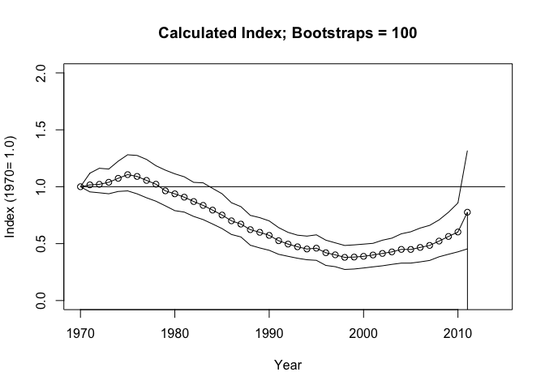<!-- -->

```
## Saving final output to file:  example_data_infile_Results.txt 
## Saving Min/Max file to:  example_data_pops_Minmax.txt 
## Saving Plot to PDF:  example_data_infile.pdf 
## [END] System: 6.328000, User: 0.226000, Elapsed: 7.270000
```

```r
# Remove NAs (trailing years with no data)
example_lpi <- example_lpi[complete.cases(example_lpi), ]

# Plot the resulting index
ggplot_lpi(example_lpi, title = "example_lpi", xlims=c(1970, 2012), ylim=c(0, 2))
```

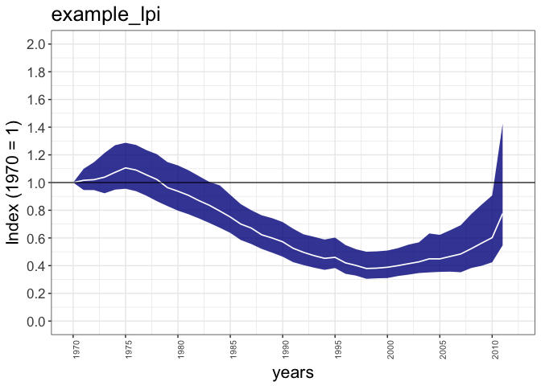<!-- -->

```r
# Plot the resulting index with logged y-axis (note the use of a +ive ymin)
ggplot_lpi(example_lpi, title = "example_lpi", xlims=c(1970, 2012), ylim=c(0.3, 2), trans="log")
```

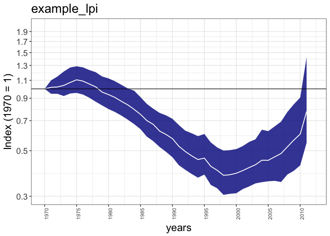<!-- -->

```r
# Here we limit the data to 'Strigiformes' simply by creating a boolean  (true/false) vector which is true for populations (rows) where the Order is "Strigiformes"
Strigiformes = lpi_data$Order == "Strigiformes" 

# Passing this vector into the create_infile function will select just those populations and create an infile for them
s_infile_name <- create_infile(lpi_data, index_vector=Strigiformes, name="example_data_strig")
# Again, create and index
s_lpi <- LPIMain(s_infile_name, REF_YEAR = 1970, PLOT_MAX = 2014, BOOT_STRAP_SIZE = 100, VERBOSE=FALSE, show_progress=FALSE)
```

```
## Number of groups:  1 
## processing file: example_data_strig_pops.txt
## Calculating LPI for Species
## Number of species: 21 (in 55 populations)
## 
## Saving species lambda to file: lpi_temp/6951435159501a64e5e4218b6ba556db_splambda.csv
## Saving species lambda to file: example_data_strig_pops_lambda.csv
## Calculating DTemp
## Saving DTemp to file:  lpi_temp/6951435159501a64e5e4218b6ba556db_dtemp.csv 
## Saving DTemp to file:  example_data_strig_pops_dtemp.csv 
## example_data_strig_pops.txt, Number of species: 21
## Saving DTemp Array to file:  example_data_strig_infile_dtemp_array.txt
```

```
## Warning: Removed 2 rows containing missing values (geom_path).
```

```
## Saving DTemp Array with filesnames to file:  example_data_strig_infile_dtemp_array_named.csv 
## [Calculating LPI...] System: 1.870000, User: 0.035000, Elapsed: 2.148000
## Group 1 is NA in year 46
## Number of valid index years: 45 (of possible 46)
## [Calculating CIs...] System: 1.910000, User: 0.035000, Elapsed: 2.189000
## ....................................................................................................
## [CIs calculated] System: 4.867000, User: 0.085000, Elapsed: 5.355000
```

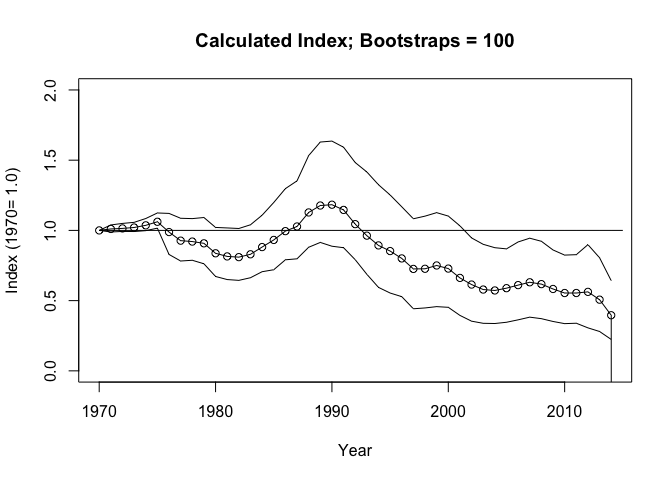<!-- -->

```
## Saving final output to file:  example_data_strig_infile_Results.txt 
## Saving Min/Max file to:  example_data_strig_pops_Minmax.txt 
## Saving Plot to PDF:  example_data_strig_infile.pdf 
## [END] System: 4.933000, User: 0.091000, Elapsed: 5.432000
```

```r
# And plot

# Remove NAs (trailing years with no data)
s_lpi <- s_lpi[complete.cases(s_lpi), ]
ggplot_lpi(s_lpi, title = "s_lpi", xlims=c(1970, 2012))
```

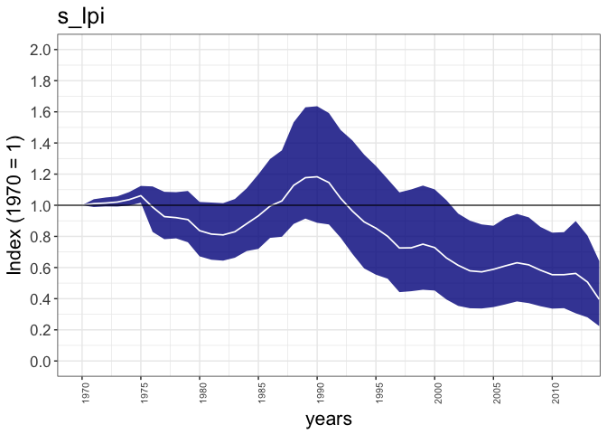<!-- -->

```r
# Similarly, this will create an index just for those populations of the Order 'Passeriformes'
Passeriformes = lpi_data$Order == "Passeriformes" 
p_infile_name <- create_infile(lpi_data, index_vector=Passeriformes, name="example_data_pass")
p_lpi <- LPIMain(s_infile_name, REF_YEAR = 1970, PLOT_MAX = 2014, BOOT_STRAP_SIZE = 100, VERBOSE=FALSE, show_progress=FALSE)
```

```
## Number of groups:  1 
## processing file: example_data_strig_pops.txt
## Calculating LPI for Species
## Number of species: 21 (in 55 populations)
## 
## Saving species lambda to file: lpi_temp/6951435159501a64e5e4218b6ba556db_splambda.csv
## Saving species lambda to file: example_data_strig_pops_lambda.csv
## Calculating DTemp
## Saving DTemp to file:  lpi_temp/6951435159501a64e5e4218b6ba556db_dtemp.csv 
## Saving DTemp to file:  example_data_strig_pops_dtemp.csv 
## example_data_strig_pops.txt, Number of species: 21
## Saving DTemp Array to file:  example_data_strig_infile_dtemp_array.txt
```

```
## Warning: Removed 2 rows containing missing values (geom_path).
```

```
## Saving DTemp Array with filesnames to file:  example_data_strig_infile_dtemp_array_named.csv 
## [Calculating LPI...] System: 1.880000, User: 0.039000, Elapsed: 2.028000
## Group 1 is NA in year 46
## Number of valid index years: 45 (of possible 46)
## [Calculating CIs...] System: 1.941000, User: 0.048000, Elapsed: 2.115000
## ....................................................................................................
## [CIs calculated] System: 4.833000, User: 0.106000, Elapsed: 5.384000
```

<!-- -->

```
## Saving final output to file:  example_data_strig_infile_Results.txt 
## Saving Min/Max file to:  example_data_strig_pops_Minmax.txt 
## Saving Plot to PDF:  example_data_strig_infile.pdf 
## [END] System: 4.892000, User: 0.112000, Elapsed: 5.455000
```

```r
# Remove NAs (trailing years with no data)
p_lpi <- p_lpi[complete.cases(p_lpi), ]
ggplot_lpi(p_lpi, title = "p_lpi", xlims=c(1970, 2012))
```

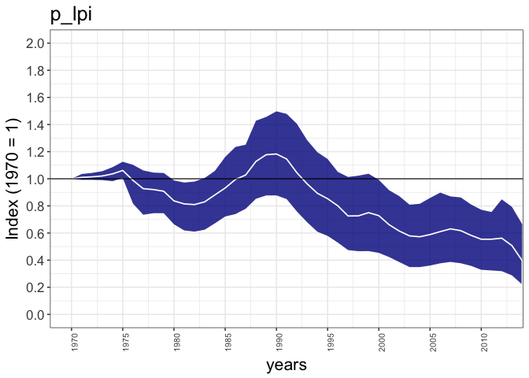<!-- -->

```r
# Nearctic mammals
Nearctic_mammals = lpi_data$Class == "Mammalia" & lpi_data$T_realm == "Nearctic"
nm_infile_name <- create_infile(lpi_data, index_vector=Nearctic_mammals, name="terrestrial_Nearctic_Mammalia")

# How many pops...
sum(Nearctic_mammals, na.rm = T)
```

```
## [1] 389
```

```r
nm_lpi <- LPIMain(nm_infile_name, REF_YEAR = 1970, PLOT_MAX = 2014, BOOT_STRAP_SIZE = 100, VERBOSE=FALSE, show_progress=FALSE)
```

```
## Number of groups:  1 
## processing file: terrestrial_Nearctic_Mammalia_pops.txt
## Calculating LPI for Species
## Number of species: 92 (in 384 populations)
## 
## Saving species lambda to file: lpi_temp/7282fa95486d2024ef7a6282067e0100_splambda.csv
## Saving species lambda to file: terrestrial_Nearctic_Mammalia_pops_lambda.csv
## Calculating DTemp
## Saving DTemp to file:  lpi_temp/7282fa95486d2024ef7a6282067e0100_dtemp.csv 
## Saving DTemp to file:  terrestrial_Nearctic_Mammalia_pops_dtemp.csv 
## terrestrial_Nearctic_Mammalia_pops.txt, Number of species: 92
## Saving DTemp Array to file:  terrestrial_Nearctic_Mammalia_infile_dtemp_array.txt
```

```
## Warning: Removed 3 rows containing missing values (geom_path).
```

```
## Saving DTemp Array with filesnames to file:  terrestrial_Nearctic_Mammalia_infile_dtemp_array_named.csv 
## [Calculating LPI...] System: 6.785000, User: 0.142000, Elapsed: 7.316000
## Group 1 is NA in year 45
## Group 1 is NA in year 46
## Number of valid index years: 44 (of possible 46)
## [Calculating CIs...] System: 6.831000, User: 0.143000, Elapsed: 7.365000
## ....................................................................................................
## [CIs calculated] System: 9.777000, User: 0.269000, Elapsed: 10.590000
```

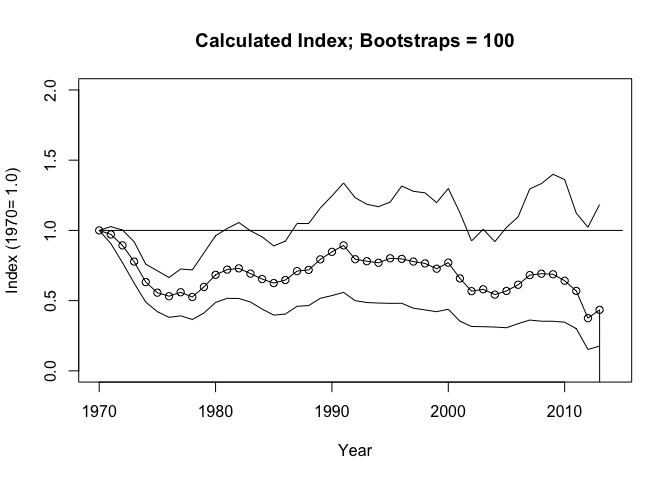<!-- -->

```
## Saving final output to file:  terrestrial_Nearctic_Mammalia_infile_Results.txt 
## Saving Min/Max file to:  terrestrial_Nearctic_Mammalia_pops_Minmax.txt 
## Saving Plot to PDF:  terrestrial_Nearctic_Mammalia_infile.pdf 
## [END] System: 9.958000, User: 0.277000, Elapsed: 10.798000
```

```r
# Remove NAs (trailing years with no data)
nm_lpi <- nm_lpi[complete.cases(nm_lpi), ]
ggplot_lpi(nm_lpi, title = "nm_lpi", xlims=c(1970, 2012))
```

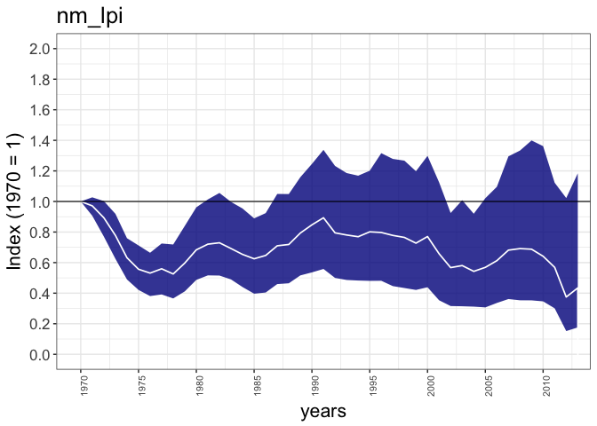<!-- -->

```r
# Nearctic birds
Nearctic_birds = lpi_data$Class == "Aves" & lpi_data$T_realm == "Nearctic"
nb_infile_name <- create_infile(lpi_data, index_vector=Nearctic_birds, name="terrestrial_Nearctic_Aves")

# How many pops...
sum(Nearctic_birds, na.rm = T)
```

```
## [1] 541
```

```r
nb_lpi <- LPIMain(nb_infile_name, REF_YEAR = 1970, PLOT_MAX = 2014, BOOT_STRAP_SIZE = 100, VERBOSE=FALSE, show_progress=FALSE)
```

```
## Number of groups:  1 
## processing file: terrestrial_Nearctic_Aves_pops.txt
## Calculating LPI for Species
## Number of species: 377 (in 541 populations)
## 
## Saving species lambda to file: lpi_temp/d99a9bebbe6d94380af43e35d4ef17a3_splambda.csv
## Saving species lambda to file: terrestrial_Nearctic_Aves_pops_lambda.csv
## Calculating DTemp
## Saving DTemp to file:  lpi_temp/d99a9bebbe6d94380af43e35d4ef17a3_dtemp.csv 
## Saving DTemp to file:  terrestrial_Nearctic_Aves_pops_dtemp.csv 
## terrestrial_Nearctic_Aves_pops.txt, Number of species: 377
## Saving DTemp Array to file:  terrestrial_Nearctic_Aves_infile_dtemp_array.txt
```

```
## Warning: Removed 2 rows containing missing values (geom_path).
```

```
## Saving DTemp Array with filesnames to file:  terrestrial_Nearctic_Aves_infile_dtemp_array_named.csv 
## [Calculating LPI...] System: 29.094000, User: 0.480000, Elapsed: 30.614000
## Group 1 is NA in year 46
## Number of valid index years: 45 (of possible 46)
## [Calculating CIs...] System: 29.128000, User: 0.480000, Elapsed: 30.649000
## ....................................................................................................
## [CIs calculated] System: 32.813000, User: 0.547000, Elapsed: 34.559000
```

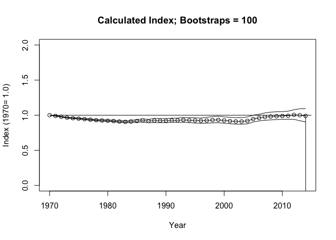<!-- -->

```
## Saving final output to file:  terrestrial_Nearctic_Aves_infile_Results.txt 
## Saving Min/Max file to:  terrestrial_Nearctic_Aves_pops_Minmax.txt 
## Saving Plot to PDF:  terrestrial_Nearctic_Aves_infile.pdf 
## [END] System: 33.081000, User: 0.555000, Elapsed: 34.845000
```

```r
# Remove NAs (trailing years with no data)
nb_lpi <- nb_lpi[complete.cases(nb_lpi), ]
ggplot_lpi(nb_lpi, title = "nb_lpi", xlims=c(1970, 2012))
```

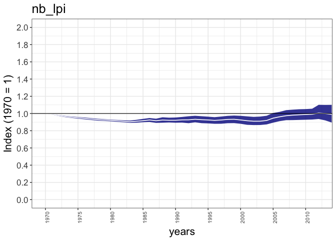<!-- -->

```r
# Nearctic herps
Nearctic_herps = (lpi_data$Class == "Reptilia" | lpi_data$Class == "Amphibia") & lpi_data$T_realm == "Nearctic"
nh_infile_name <- create_infile(lpi_data, index_vector=Nearctic_herps, name="terrestrial_Nearctic_Herps")

# How many pops...
sum(Nearctic_herps, na.rm = T)
```

```
## [1] 102
```

```r
nh_lpi <- LPIMain(nh_infile_name, REF_YEAR = 1970, PLOT_MAX = 2014, BOOT_STRAP_SIZE = 100, VERBOSE=FALSE, show_progress=FALSE)
```

```
## Number of groups:  1 
## processing file: terrestrial_Nearctic_Herps_pops.txt
## Calculating LPI for Species
## Number of species: 58 (in 102 populations)
## 
## Saving species lambda to file: lpi_temp/ffa9d8ac9ddc787613f91b2f3f82a834_splambda.csv
## Saving species lambda to file: terrestrial_Nearctic_Herps_pops_lambda.csv
## Calculating DTemp
## Saving DTemp to file:  lpi_temp/ffa9d8ac9ddc787613f91b2f3f82a834_dtemp.csv 
## Saving DTemp to file:  terrestrial_Nearctic_Herps_pops_dtemp.csv 
## terrestrial_Nearctic_Herps_pops.txt, Number of species: 58
## Saving DTemp Array to file:  terrestrial_Nearctic_Herps_infile_dtemp_array.txt
```

```
## Warning: Removed 1 rows containing missing values (geom_path).
```

```
## Saving DTemp Array with filesnames to file:  terrestrial_Nearctic_Herps_infile_dtemp_array_named.csv 
## [Calculating LPI...] System: 1.653000, User: 0.050000, Elapsed: 1.809000
## Number of valid index years: 46 (of possible 46)
## [Calculating CIs...] System: 1.697000, User: 0.050000, Elapsed: 1.854000
## ....................................................................................................
## [CIs calculated] System: 4.586000, User: 0.164000, Elapsed: 5.122000
```

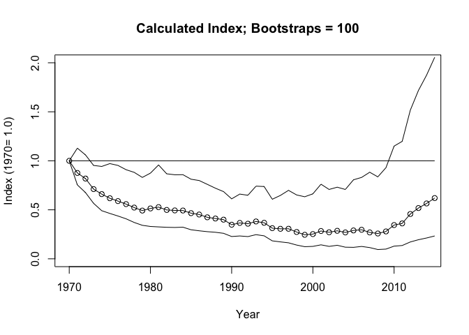<!-- -->

```
## Saving final output to file:  terrestrial_Nearctic_Herps_infile_Results.txt 
## Saving Min/Max file to:  terrestrial_Nearctic_Herps_pops_Minmax.txt 
## Saving Plot to PDF:  terrestrial_Nearctic_Herps_infile.pdf 
## [END] System: 4.649000, User: 0.168000, Elapsed: 5.191000
```

```r
# Remove NAs (trailing years with no data)
nh_lpi <- nh_lpi[complete.cases(nh_lpi), ]
ggplot_lpi(nh_lpi, title = "nh_lpi", xlims=c(1970, 2012))
```

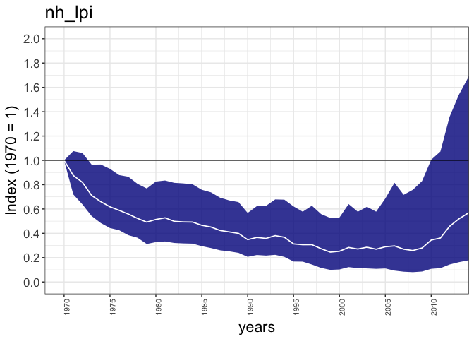<!-- -->

Constructing infiles


